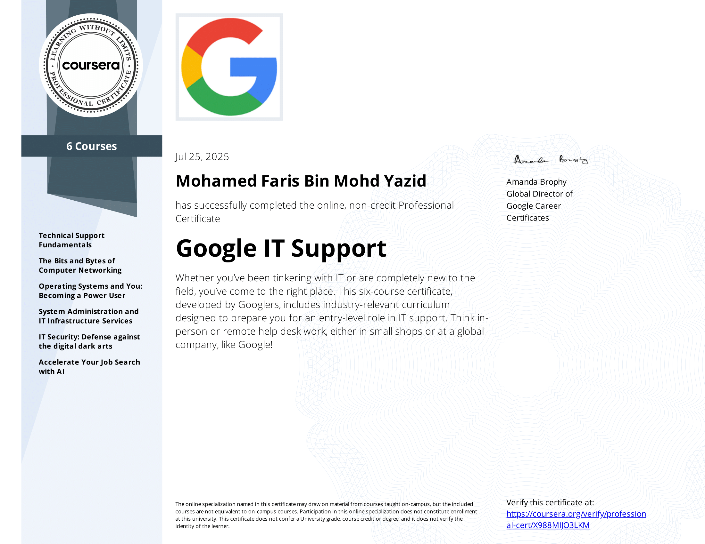

# Google-IT-Support
This course is good for those who are trying to get into IT and have no background knowledge. You are also able to get a 50% discount voucher for the CompTia A+ certification once you completed this course. 

## Topics Covered
- Technical Support Fundamentals
- The Bits and Bytes of Computer Networking
- System Administration and IT Infrastructure Services
- IT Security: Defence against the digital dark arts

## My Certificate

